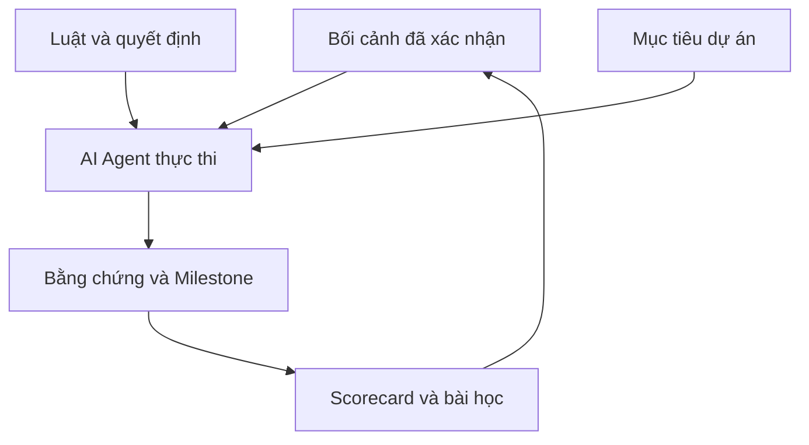

# MH Master Memory

> **Hệ điều hành trí nhớ, quyết định và điều phối đa AI cho hệ sinh thái Minh Hiếu.**

**MH Master Memory** là kho nội bộ tập trung những gì các AI Agent cần biết trước khi tham gia một dự án trong hệ sinh thái Minh Hiếu: bối cảnh đã xác nhận, nguyên tắc làm việc, quyết định quan trọng, cột mốc thực thi, bằng chứng kiểm thử, lỗi đã xảy ra và bài học không được phép quên.

Mục tiêu của dự án không phải để AI “nhớ nhiều hơn”, mà để mọi AI **làm đúng hơn, trung thực hơn và phối hợp nhất quán hơn** qua nhiều phiên làm việc, nhiều công cụ và nhiều dự án khác nhau.

## Dự án giải quyết điều gì?

- Giảm tình trạng mỗi AI hiểu một kiểu hoặc bắt đầu lại từ đầu.
- Ngăn lặp lại lỗi đã biết và bảo vệ các tài sản đã được khóa.
- Buộc mọi tuyên bố hoàn thành phải đi kèm trạng thái và bằng chứng.
- Ghi lại quyết định, lý do, đánh đổi và người phê duyệt.
- Đối chiếu chất lượng làm việc giữa các AI bằng cùng một Scorecard.
- Giữ các dự án độc lập, nhưng vẫn kết nối được thành một hệ sinh thái.

## Vai trò và quyền quyết định

AI Agent được phép phân tích, phản biện, đề xuất, thực thi trong phạm vi được giao và ghi lại bằng chứng. **Đặng Minh Hiếu giữ quyền quyết định cuối cùng.**



## Bốn lớp lõi

| Lớp | Chức năng |
| --- | --- |
| **Memory** | Lưu bối cảnh, cột mốc, lỗi và bài học xuyên phiên |
| **Decision** | Ghi quyết định, lý do, rủi ro, đánh đổi và phê duyệt |
| **Evidence** | Phân biệt rõ Tested, Untested và kiểm thử một phần |
| **Governance** | Quy định phạm vi, tài sản đã khóa và quyền của AI Agent |

## Cấu trúc kho

```text
MH-Master-Memory-AI-Ecosystem/
├── README.md
├── STATE.md
├── TASK-LEDGER.md
├── AGENTS.md
├── CLAUDE.md
├── GEMINI.md
├── LOVABLE.md
├── AI-BOOTSTRAP.md
├── AI-ROLES.md
├── SECURITY.md
├── skills/
│   └── prompt-master/
├── scripts/
│   └── install-prompt-master-windows.ps1
├── docs/
│   ├── core/
│   │   ├── DRIFT-AUDIT.md
│   │   ├── DECISION-OPERATING-SYSTEM.md
│   │   ├── PRODUCT-UI-STANDARD.md
│   │   ├── RISK-TIERS.md
│   │   └── MASTER-MEMORY-SCORECARD.md
│   ├── context/
│   │   ├── OWNER-PROFILE.md
│   │   └── ECOSYSTEM-CONTEXT.md
│   ├── references/
│   │   └── SKILL-SOURCE-CATALOG.md
│   └── setup/
│       └── PROMPT-MASTER.md
├── templates/
│   ├── DECISION-ENTRY.md
│   └── MILESTONE-ENTRY.md
└── logs/
    └── MILESTONES.md
```

## Cách một AI Agent bắt đầu

1. Mở repository này làm thư mục gốc hoặc cấp quyền đọc repository Private.
2. Đọc `STATE.md` trước mọi file khác, kể cả trước file khởi động.
3. Chỉ đọc mục **Đang làm / Đã thi công** trong `TASK-LEDGER.md`; tiếp tục Task ID phù hợp và không quét nhầm dự án.
4. Đọc file khởi động tương ứng: Codex dùng `AGENTS.md`, Claude Code dùng `CLAUDE.md`, Google Antigravity dùng `GEMINI.md`, Lovable dùng `LOVABLE.md` trong Project Knowledge.
5. Đọc `AI-BOOTSTRAP.md`, `AI-ROLES.md` và tự động phân loại công việc theo `docs/core/RISK-TIERS.md` trước khi hành động.
6. Chỉ đọc các tài liệu sâu liên quan; nhiệm vụ giao diện mới bắt buộc đọc `PRODUCT-UI-STANDARD.md`.
7. Tác vụ lớn phải ký trước khi ghi file; cờ `/master`, `- master` hoặc `• master` buộc lưu ngay cả việc nhỏ. Thi công xong thì ghi `ĐÃ THI CÔNG`; không tạo hàng chờ duyệt mặc định.
8. Thực thi, kiểm thử và lưu bằng chứng thật.
9. Kết thúc bằng cập nhật Task ID và một Milestone Entry trong `logs/MILESTONES.md`.

## Bộ khởi động đa AI

| Công cụ | Điểm vào | Cách dùng |
| --- | --- | --- |
| Codex | `AGENTS.md` | Tự đọc khi chạy trong repository |
| Claude Code | `CLAUDE.md` | Tự nhập luật chung từ `AGENTS.md` |
| Google Antigravity | `GEMINI.md` | Đọc luật chung và quy tắc workspace |
| Lovable | `LOVABLE.md` | Dán một lần vào Project Knowledge của từng sản phẩm |

### Skill Prompt Master dùng chung

`skills/prompt-master/` là nguồn chuẩn để viết, sửa, audit và chuyển đổi prompt cho nhiều công cụ. ChatGPT/Codex dùng bản skill cá nhân; Claude Code có project skill trong `.claude/skills/`; Claude Code và Google Antigravity trên Windows được cài toàn cục bằng `scripts/install-prompt-master-windows.ps1`. Hướng dẫn đầy đủ nằm tại `docs/setup/PROMPT-MASTER.md`.

### Thứ tự ưu tiên thực tế

1. **Google Antigravity:** môi trường thi công chính.
2. **ChatGPT + Codex:** một đầu não chung để tiếp nhận yêu cầu, điều phối, kiểm tra và giữ Master Memory.
3. **Claude Code:** chuyên gia dự phòng cho ca khó, audit hoặc phản biện độc lập.
4. **Lovable:** chuyên gia thiết kế UI/UX và giao diện sản phẩm.

Chi tiết quyền hạn và quy tắc chống xung đột nằm trong `AI-ROLES.md`.

## Nguyên tắc bất khả xâm phạm

1. Chất lượng thật quan trọng hơn số lượng đầu việc.
2. Không nói “đã xong” khi chưa có bằng chứng phù hợp.
3. Chưa kiểm thử phải ghi rõ **Untested**.
4. Không tự đổi mục tiêu, tự giảm phạm vi hoặc thêm việc ngoài yêu cầu.
5. Không xóa, ghi đè hoặc phá tài sản đã khóa khi chưa được phê duyệt.
6. Sai phải ghi đúng lỗi, sửa hậu quả và tạo biện pháp ngăn tái diễn.
7. Mỗi dự án phải rõ nét và hoạt động độc lập trước khi tích hợp hệ sinh thái.
8. Chức năng tốt là nghĩa vụ mặc định; sản phẩm có UI chỉ đạt khi giao diện cũng đúng baseline, trực quan và thể hiện sự tôn trọng người dùng.

## Phạm vi sản phẩm

Kho này là **lớp điều hành nội bộ**, không thay thế mã nguồn của các sản phẩm như SampleGuard FL, MH-FileOS hay công cụ thu thập sample. Mỗi sản phẩm vẫn có kho, lộ trình, kiểm thử và gói thương mại riêng; MH Master Memory chỉ giữ bối cảnh chung, quyết định liên dự án và chuẩn phối hợp AI.

## Trạng thái

**Internal / Private — v1.0 Foundation**

Khung lõi đã được hình thành từ tài liệu vận hành thực tế. Các cơ chế đồng bộ tự động, phân quyền máy đọc được và dashboard Scorecard vẫn phải được triển khai, kiểm thử và ghi bằng chứng trước khi xem là tính năng hoàn chỉnh.

## Quyền sở hữu

Copyright © 2026 Đặng Minh Hiếu / MINH HIEU STUDIO. All rights reserved.

Kho này chứa tài liệu vận hành nội bộ. Không sao chép, chia sẻ, công khai hoặc sử dụng lại khi chưa có sự cho phép bằng văn bản của chủ sở hữu.
